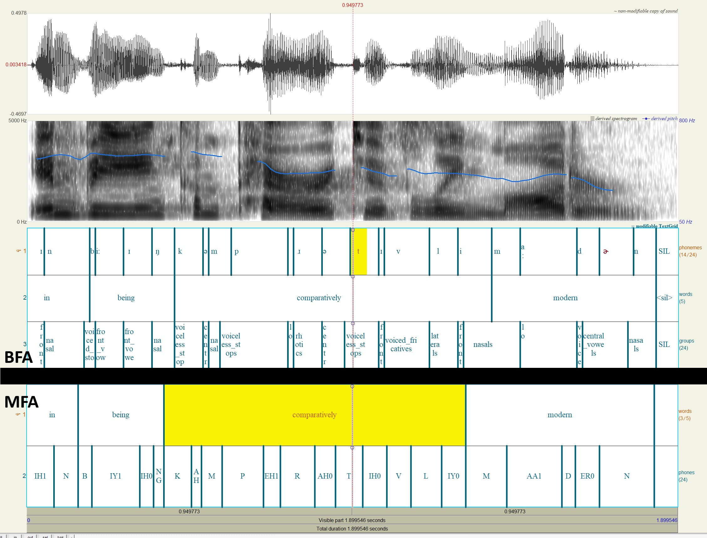
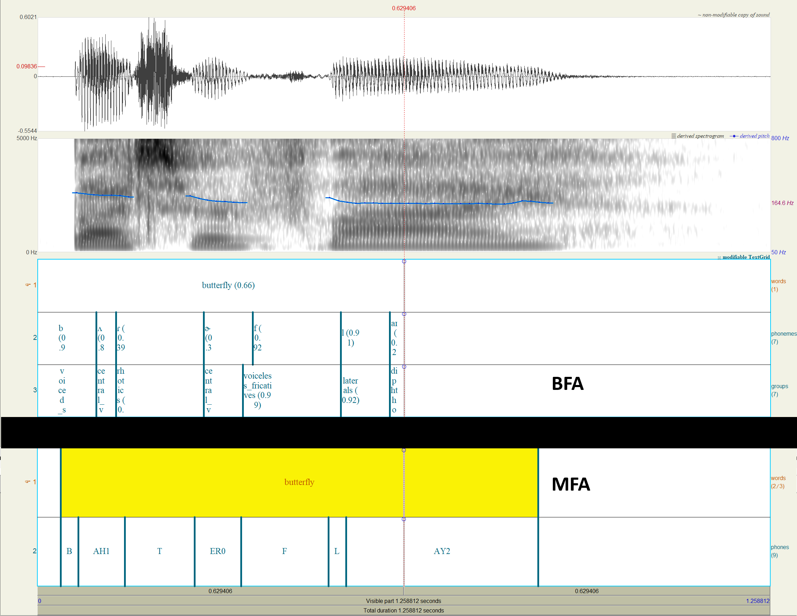

# 🎯 Bournemouth Forced Aligner (BFA)

<div align="center">

[](https://www.python.org/downloads/)
[](https://badge.fury.io/py/bournemouth-forced-aligner)
[](https://www.gnu.org/licenses/gpl-3.0)
[](https://github.com/tabahi/bournemouth-forced-aligner/stargazers)

**High-precision phoneme-level timestamp extraction from audio files**

[🚀 Quick Start](#-getting-started) • [📚 Documentation](#-how-does-it-work) • [🔧 Installation](#-installation) • [💻 CLI](#-command-line-interface-cli) • [🤝 Contributing](https://github.com/tabahi/bournemouth-forced-aligner/issues)

</div>

---

## ✨ Overview

BFA is a lightning-fast Python library that extracts **phoneme-level timestamps** from audio files with millisecond precision. Built on the powerful [Contextless Universal Phoneme Encoder (CUPE)](https://github.com/tabahi/contexless-phonemes-CUPE), it delivers professional-grade forced alignment for speech analysis, linguistics research, and audio processing applications.

> 🎯 **Find the exact time when any phoneme is spoken** - provided you have the audio and its transcription

## 🌟 Key Features

<div align="center">

| Feature | Description | Performance |
|---------|-------------|-------------|
| ⚡ **Ultra-Fast** | CPU-optimized processing | 0.2s for 10s audio |
| 🎯 **Phoneme-Level** | Millisecond-precision timestamps | High accuracy alignment |
| 🧠 **Smart Algorithm** | Viterbi with confidence scoring | Target boosting support |
| 🌍 **Multi-Language** | Via espeak phonemization | *English model ready |
| 🔧 **Easy Integration** | JSON & TextGrid output | Praat compatibility |
| 📊 **Rich Embeddings** | Contextless phoneme features | ML-ready format |
| 💻 **CLI Ready** | Command-line interface | Batch processing support |

</div>

### 🎨 Core Capabilities

- **🎵 Phoneme-level timestamp extraction** with high accuracy
- **🔍 Viterbi algorithm** with confidence scoring and target boosting  
- **🌐 Multi-language support** via espeak phonemization (*English model currently available)
- **📊 Embedding extraction** - contextless, pure phoneme embeddings for ML tasks
- **📝 Word-level alignment** derived from phoneme timestamps
- **⚙️ Command-line interface** for hands-off batch processing
- **📋 Multiple output formats**: JSON and TextGrid for Praat integration

---

## 🚀 Installation

### 📦 From PyPI (Recommended)

```bash
# Install the package
pip install bournemouth-forced-aligner

# Install system dependencies
apt-get install espeak-ng ffmpeg
```

### ✅ Verify Installation

```bash
# Show help
balign --help

# Check version
balign --version

# Test installation
python -c "from bournemouth_aligner import PhonemeTimestampAligner; print('✅ Installation successful!')"
```

---

## 🎯 Getting Started

### 🔥 Quick Example

```python
import torch
import time
import json
from bournemouth_aligner import PhonemeTimestampAligner

# Configuration
transcription = "butterfly"
audio_path = "examples/samples/audio/109867__timkahn__butterfly.wav"
model_name = "en_libri1000_uj01d_e199_val_GER=0.2307.ckpt"

# Initialize aligner
extractor = PhonemeTimestampAligner(
    model_name=model_name, 
    lang='en-us', 
    duration_max=10, 
    device='cpu'
)

# Load and process
audio_wav = extractor.load_audio(audio_path)

t0 = time.time()
timestamps = extractor.process_transcription(
    transcription, 
    audio_wav, 
    ts_out_path=None, 
    extract_embeddings=False, 
    vspt_path=None, 
    do_groups=True, 
    debug=True
)
t1 = time.time()

print("🎯 Timestamps:")
print(json.dumps(timestamps, indent=4, ensure_ascii=False))
print(f"⚡ Processing time: {t1 - t0:.2f} seconds")
```

### 📊 Sample Output

<details>
<summary>📋 Click to see detailed JSON output</summary>

```json
{
    "segments": [
        {
            "start": 0.0,
            "end": 1.2588125,
            "text": "butterfly",
            "ph66": [29, 10, 58, 9, 43, 56, 23],
            "pg16": [7, 2, 14, 2, 8, 13, 5],
            "coverage_analysis": {
                "target_count": 7,
                "aligned_count": 7,
                "missing_count": 0,
                "extra_count": 0,
                "coverage_ratio": 1.0,
                "missing_phonemes": [],
                "extra_phonemes": []
            },
            "ipa": ["b", "ʌ", "ɾ", "ɚ", "f", "l", "aɪ"],
            "word_num": [0, 0, 0, 0, 0, 0, 0],
            "words": ["butterfly"],
            "phoneme_ts": [
                {
                    "phoneme_idx": 29,
                    "phoneme_label": "b",
                    "start_ms": 33.56833267211914,
                    "end_ms": 50.35249710083008,
                    "confidence": 0.9849503040313721
                },
                {
                    "phoneme_idx": 23,
                    "phoneme_label": "aɪ",
                    "start_ms": 604.22998046875,
                    "end_ms": 621.01416015625,
                    "confidence": 0.21650740504264832
                }
            ],
            "words_ts": [
                {
                    "word": "butterfly",
                    "start_ms": 33.56833267211914,
                    "end_ms": 621.01416015625,
                    "confidence": 0.6550856615815844,
                    "ph66": [29, 10, 58, 9, 43, 56, 23],
                    "ipa": ["b", "ʌ", "ɾ", "ɚ", "f", "l", "aɪ"]
                }
            ]
        }
    ]
}
```

</details>

### 🔑 Output Format Guide

| Key | Description | Format |
|-----|-------------|--------|
| `ph66` | Standardized 66 phoneme classes (including silence) | See [mapper66.py](bournemouth_aligner/mapper66.py) |
| `pg16` | 16 phoneme category groups (lateral, vowels, rhotics, etc.) | Grouped classifications |
| `ipa` | IPA sequences from espeak | Unicode IPA symbols |
| `words` | Word segmentation | Regex-based: `\b\w+\b` |
| `phoneme_ts` | Aligned phoneme timestamps | Millisecond precision |
| `group_ts` | Phoneme group timestamps | Often more accurate |
| `word_num` | Word index for each phoneme | Maps phonemes to words |
| `words_ts` | Word-level timestamps | Derived from phonemes |
| `coverage_analysis` | Alignment quality metrics | Insertions/deletions |

---

## 📈 Alignment Accuracy

### 🔬 Comparative Analysis

Our alignment quality compared to Montreal Forced Aligner (MFA) using [Praat](https://www.fon.hum.uva.nl/praat/) TextGrid visualization:

<div align="center">

| Metric | BFA | MFA |
|--------|-----|-----|
| **Speed** | 0.2s per 10s audio | 10s per 2s audio |
| **Real-time potential** | ✅ Yes (contextless) | ❌ No |
| **Stop consonants** | ✅ Better (t,d,p,k) | ⚠️ Standard |
| **Tail endings** | ⚠️ Sometimes missed | ✅ Good |
| **Breathy sounds** | ⚠️ Misses h# | ✅ Captures |

</div>

### 📊 Sample Visualizations

**"In being comparatively modern..."** - LJ Speech Dataset  
[🎵 Audio Sample](examples/samples/LJSpeech/LJ001-0002.wav)



**"Butterfly" with Confidence Values**  
[🎵 Audio Sample](examples/samples/audio/109867__timkahn__butterfly.wav)



> **Note**: Timing distance error is ~40ms on TIMIT dataset. BFA excels in real-time applications where MFA's 5x slower processing becomes prohibitive.

---

## 🧠 How Does It Work?

### 🔄 Processing Pipeline

```mermaid
graph LR
    A[Audio Input] --> B[CUPE Feature Extraction]
    B --> C[Phoneme Probabilities]
    C --> D[Viterbi Algorithm]
    D --> E[Forward/Backward Tracing]
    E --> F[Timestamp Alignment]
    F --> G[Confidence Scoring]
```

**Core Components:**

1. **🎵 CUPE Integration**: Extracts phoneme probabilities from [CUPE models](https://huggingface.co/Tabahi/CUPE-2i)
2. **🧮 Viterbi Algorithm**: Performs optimal path finding through probability matrices
3. **🔄 Forward/Backward Tracing**: Identifies precise phoneme boundaries
4. **📊 Confidence Scoring**: Provides alignment quality metrics

> **Performance Note**: The algorithm is CPU-optimized due to iterative loops. GPU acceleration is planned for future releases.

---

## 🔧 Advanced Usage

### 🎙️ Whisper Integration

Extract timestamps directly from audio using Whisper transcription:

```python
# pip install git+https://github.com/openai/whisper.git 

import whisper
import json
from bournemouth_aligner import PhonemeTimestampAligner

# Transcribe with Whisper
model = whisper.load_model("turbo")
audio_path = "audio.wav"
result = model.transcribe(audio_path)

# Save transcription
srt_path = "whisper_output.srt.json"
with open(srt_path, "w") as f:
    json.dump(result, f)

# Align with BFA
extractor = PhonemeTimestampAligner(
    model_name="en_libri1000_uj01d_e199_val_GER=0.2307.ckpt",
    lang='en-us',
    duration_max=10,
    device='cpu'
)

timestamps = extractor.process_srt_file(
    srt_path, 
    audio_path, 
    "timestamps.json",
    extract_embeddings=False,
    debug=False
)
```

### 🔬 Step-by-Step Processing

<details>
<summary>📖 Detailed notebook-style implementation</summary>

```python
import torch
import torchaudio
from bournemouth_aligner import PhonemeTimestampAligner

# Step 1: Initialize
device = 'cpu'  # CPU is faster for single files
duration_max = 10
model_name = "en_libri1000_uj01d_e199_val_GER=0.2307.ckpt"
lang = 'en-us'

extractor = PhonemeTimestampAligner(
    model_name=model_name,
    lang=lang,
    duration_max=duration_max,
    device=device
)

# Step 2a: Manual audio preprocessing
audio_path = "examples/samples/audio/Schwa-What.wav"
audio_wav, sr = torchaudio.load(audio_path, normalize=True)

# Resample to CUPE's 16kHz
resampler = torchaudio.transforms.Resample(
    orig_freq=sr,
    new_freq=16000,
    lowpass_filter_width=64,
    rolloff=0.9475937167399596,
    resampling_method="sinc_interp_kaiser",
    beta=14.769656459379492,
)
audio_wav = resampler(audio_wav)

# RMS normalize
rms = torch.sqrt(torch.mean(audio_wav ** 2))
audio_wav = (audio_wav / rms) if rms > 0 else audio_wav

# Step 2b: Simplified loading
# audio_wav = extractor.load_audio(audio_path)

# Step 3: Process transcription
transcription = "ah What!"
timestamps = extractor.process_transcription(
    transcription,
    audio_wav,
    ts_out_path=None,
    extract_embeddings=False,
    vspt_path=None,
    do_groups=True,
    debug=False
)

# Step 4: Export to TextGrid
extractor.convert_to_textgrid(
    timestamps,
    output_file="output_timestamps.TextGrid",
    include_confidence=False
)
```

</details>

### 🤖 Machine Learning Integration

For phoneme embeddings in ML pipelines, check out our [embeddings example](examples/read_embeddings.py).

---

## 💻 Command Line Interface (CLI)

### 🚀 Quick CLI Usage

```bash
# Basic alignment
balign audio.wav transcription.srt.json output.json

# With debug output
balign audio.wav transcription.srt.json output.json --debug

# Extract embeddings
balign audio.wav transcription.srt.json output.json --embeddings embeddings.pt
```

### ⚙️ Command Syntax

```bash
balign [OPTIONS] AUDIO_PATH SRT_PATH OUTPUT_PATH
```

### 📝 Arguments & Options

<div align="center">

| Parameter | Type | Default | Description |
|-----------|------|---------|-------------|
| `AUDIO_PATH` | **Required** | - | Audio file path (.wav, .mp3, .flac) |
| `SRT_PATH` | **Required** | - | SRT JSON file path |
| `OUTPUT_PATH` | **Required** | - | Output timestamps (.json) |

</div>

<details>
<summary>🔧 Advanced Options</summary>

| Option | Default | Description |
|--------|---------|-------------|
| `--model TEXT` | `en_libri1000_uj01d_e199_val_GER=0.2307.ckpt` | CUPE model from [HuggingFace](https://huggingface.co/Tabahi/CUPE-2i/tree/main/ckpt) |
| `--lang TEXT` | `en-us` | Language code ([espeak codes](https://github.com/espeak-ng/espeak-ng/blob/master/docs/languages.md)) |
| `--device TEXT` | `cpu` | Processing device (`cpu` or `cuda`) |
| `--embeddings PATH` | None | Save phoneme embeddings (.pt file) |
| `--duration-max FLOAT` | `10.0` | Max segment duration (seconds) |
| `--debug / --no-debug` | `False` | Enable detailed output |
| `--boost-targets / --no-boost-targets` | `True` | Enable target phoneme boosting |
| `--help` | | Show help message |
| `--version` | | Show version info |

</details>

### 🌟 CLI Examples

<details>
<summary>📚 Comprehensive usage examples</summary>

#### Basic Operations
```bash
# Simple English alignment
balign speech.wav transcription.srt.json timestamps.json

# With embeddings for ML
balign speech.wav transcription.srt.json timestamps.json --embeddings speech_embeddings.pt
```

#### Multi-language Support (*Planned)
```bash
# Spanish audio
balign spanish_audio.wav transcription.srt.json output.json --lang es

# French audio  
balign french_audio.wav transcription.srt.json output.json --lang fr

# German audio
balign german_audio.wav transcription.srt.json output.json --lang de
```

#### Performance Optimization
```bash
# GPU acceleration
balign large_audio.wav transcription.srt.json output.json --device cuda

# Custom model with extended duration
balign audio.wav transcription.srt.json output.json \
    --model "en_libri1000_uj01d_e199_val_GER=0.2307.ckpt" \
    --duration-max 15 \
    --debug \
    --embeddings embeddings.pt
```

#### Batch Processing
```bash
#!/bin/bash
# Process multiple files
for audio in *.wav; do
    base=$(basename "$audio" .wav)
    balign "$audio" "${base}.srt" "${base}_timestamps.json" --debug
done
```

</details>

### 📊 Input Format

SRT files must be in JSON format:

```json
{
  "segments": [
    {
      "start": 0.0,
      "end": 3.5,
      "text": "hello world this is a test"
    },
    {
      "start": 3.5,
      "end": 7.2,  
      "text": "another segment of speech"
    }
  ]
}
```

### 🎯 Creating Input Files

<details>
<summary>📝 Methods for generating SRT files</summary>

**From Whisper:**
```python
import whisper
import json

model = whisper.load_model("base")
result = model.transcribe("audio.wav")

# Convert to BFA format
srt_data = {"segments": result["segments"]}
with open("transcription.srt.json", "w") as f:
    json.dump(srt_data, f, indent=2)
```

**Manual Creation:**
```python
import json

srt_data = {
    "segments": [
        {
            "start": 0.0,
            "end": 2.5,
            "text": "your transcribed text here"
        }
    ]
}

with open("transcription.srt.json", "w") as f:
    json.dump(srt_data, f, indent=2)
```

</details>

### 🔍 Debug Mode

Enable comprehensive processing information:

```bash
balign audio.wav transcription.srt.json output.json --debug
```

<details>
<summary>📊 Sample debug output</summary>

```
🚀 Bournemouth Forced Aligner
🎵 Audio: audio.wav
📄 SRT: transcription.srt.json  
💾 Output: output.json
🏷️  Language: en-us
🖥️  Device: cpu
🎯 Model: en_libri1000_uj01d_e199_val_GER=0.2307.ckpt
--------------------------------------------------
🔧 Initializing aligner...
Setting backend for language: en-us
✅ Aligner initialized successfully
🎵 Processing audio...
Loaded SRT file with 1 segments from transcription.srt.json
Resampling audio.wav from 22050Hz to 16000Hz
Expected phonemes: ['p', 'ɹ', 'ɪ', ...'ʃ', 'ə', 'n']
Target phonemes: 108, Expected: ['p', 'ɹ', 'ɪ', ..., 'ʃ', 'ə', 'n']
Spectral length: 600
Forced alignment took 135.305 ms
Aligned phonemes: 108
Target phonemes: 108
SUCCESS: All target phonemes were aligned!

============================================================
PROCESSING SUMMARY
============================================================
Total segments processed: 1
Perfect sequence matches: 1/1 (100.0%)
Total phonemes aligned: 108
Overall average confidence: 0.502
============================================================
Results saved to: output.json
✅ Timestamps extracted to output.json
📊 Processed 1 segments with 108 phonemes
🎉 Processing completed successfully!
```

</details>

---

## 🤝 Contributing & Support

<div align="center">

### 📞 Get Help

[](https://github.com/tabahi/bournemouth-forced-aligner/issues)

</div>


### 💡 Feature Requests

We welcome suggestions for:
- Additional language models
- Performance improvements  
- New output formats
- Integration examples

### 🔬 Research Collaboration

If you use BFA in academic research, we'd love to hear about it! Consider:
- Sharing your findings and comparisons
- Contributing evaluation datasets
- Proposing algorithmic improvements


---

<div align="center">


[⭐ Star us on GitHub](https://github.com/tabahi/bournemouth-forced-aligner) • [🐛 Report Issues](https://github.com/tabahi/bournemouth-forced-aligner/issues)

</div>